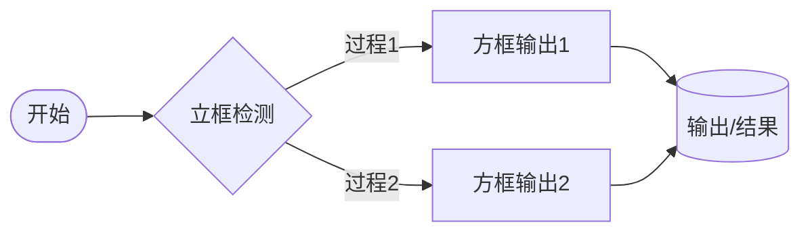

#我的网站
这是我自己的**测试学习**用的项目，测试包括**Markdown**，**前端**，**github**还有**协作**测试。
##开头
```html
<html>


</html>
```
##Markdown流程图测试

:

> [!提示]
> 测试

> [!TIP]
> 测试

> [!IMPORTANT]
> Key information users need to know to achieve their goal.

> [!WARNING]
> Urgent info that needs immediate user attention to avoid problems.

> [!CAUTION]
> Advises about risks or negative outcomes of certain actions.